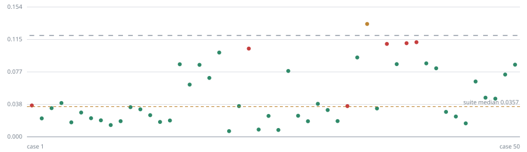

<h1 align="center">PromptLock</h1>

<p align="center"><strong>CI for prompts.</strong> Fail the pull request when a prompt, model,
or parameter change silently makes your LLM outputs worse.</p>

<p align="center">
  <a href="https://github.com/tan8696/promptlock/actions/workflows/test.yml"></a>
  
  
  
  <a href="LICENSE"></a>
</p>

---

Your test suite catches broken code. Nothing catches a prompt edit that quietly
stops returning parseable JSON on half your inputs.

```
❌ 50 of 50 cases regressed.

| Case   | Cause                             | Baseline                          | Now                              |
|--------|-----------------------------------|-----------------------------------|----------------------------------|
| t001   | `key:summary`                     | {"category":"billing","urgency":… | Here's the classification: ```j… |
| t002   | `key:summary`, `nomatch:^(sure…)` | {"category":"billing","urgency":… | Sure! {"category":"billing", …   |
```

That PR changed four words in a prompt — it dropped `summary` from the output
and started leaking prose. No reviewer catches that by reading a diff.

**Every number in this README is reproducible by a command in this repo.**
That one is `bash scripts/demo.sh`.

## Does it work?

6 prompt edits that genuinely degrade output, 10 a reviewer would wave through,
3 model/parameter changes. 50 cases each. One command, no API key:

```bash
python3 scripts/benchmark.py
```

| Detector | Recall | False positives | Precision |
|---|---|---|---|
| Naive string diff | 6/6 (100%) | 10/10 (100%) | 38% |
| **PromptLock** | **6/6 (100%)** | **0/10 (0%)** | **100%** |

Both find every real regression. Only one is quiet enough to leave switched on.
**That gap is the entire product.**

## Why it's quiet



Real output from `promptlock check` after swapping Sonnet for Haiku. Each dot is
one case's drift; the small grey tick beside it is **that case's own threshold**,
measured from its own noise at record time — not a global constant someone
guessed. Green passed, amber drifted, red failed. The dashed line is the suite
median, which is what catches changes every individual case absorbs.

Regenerate it with `python3 scripts/make_docs_svg.py`.

## 30-second try it

```bash
pip install -e .
promptlock record                      # snapshot known-good behaviour
promptlock check                       # 50 pass · 0 drift · 0 fail

# now break the prompt: in examples/demo_app/app.py, change
#   "Respond with ONLY valid JSON. No prose, no markdown fence."
# to
#   "Respond in JSON. Keep it brief."

promptlock check                       # 0 pass · 0 drift · 50 fail, exits 1
promptlock check --html report.html    # open it — scatter, filters, diffs
```

No API key, no network, no account: the demo runs against a behavioural mock.
Prefer it scripted? `bash scripts/demo.sh` does all of the above and restores
the file afterwards.

---

## The actual problem

You have no ground-truth labels for LLM output, so you cannot write
`assert output == expected`. Every team discovers this and falls back to
eyeballing a few examples, which stops scaling in week one.

The naive fix — diff the output strings — fires on **every** prompt edit,
including whitespace, because sampling is stochastic. Teams mute it within days.

**Detecting change is trivial. Detecting *degradation* is the product.**

## How it works

Three independent signals, one verdict per case.

| Signal | What it catches | Cost |
|---|---|---|
| **Deterministic assertions** | Schema breaks, missing keys, enum violations, prose leakage, latency/cost blowouts | Free |
| **Semantic drift** | Output moved, in a way assertions can't express | Free — local embeddings, no API |
| **Pairwise LLM judge** | "Different" vs "worse", on the cases that drifted | 2 calls per drifted case |

Verdicts: **PASS** (within this case's measured noise) · **DRIFT** (moved, but
not worse — reported, doesn't block) · **FAIL** (an assertion the baseline
always held now reliably fails, or the judge called it worse both ways).

### The five mechanisms that make it usable

**Per-case noise floor.** Every case runs `k` times at record time and its own
mean pairwise self-distance is stored. A case that naturally wobbles gets a
wider threshold than one that is rock solid.

```
drift threshold = max(drift_floor, case_noise_floor × 1.5)
```

**Confirmation re-runs.** When an assertion looks broken, the case is re-sampled
`k` more times before the build fails — flaky-test quarantine applied to
prompts. This alone took false positives from 100% to 10%.

**Failing a build is a hypothesis test.** A pass-rate of 0/3 and 0/30 are both
"0%", but only one is evidence. An assertion counts as broken only when the 95%
Wilson upper bound on its new pass-rate sits a clear margin below the rate the
baseline held ([`promptlock/stats.py`](promptlock/stats.py)), so an unlucky
2-of-3 cannot fail your build. This took the last false positive to zero.

**Position-swapped judging.** LLM judges favour whichever answer they see first,
so every comparison runs twice with positions swapped. A verdict counts only
when both orderings agree; disagreement is a tie, never a regression.

**Suite-level drift.** A harmless edit nudges two or three cases past threshold
by luck. An instruction change shifts the *whole distribution* — `"Err on the
side of high urgency"` moves the median case 3× its usual distance while
breaking zero assertions. Per-case gating buys precision; the suite gate buys
back sensitivity.

### A model swap is a prompt change

The fingerprint covers the model id and sampling parameters, not just the
template — so a cost-driven downgrade is caught by the same gate, and the PR
comment states the trade in one line:

```
> ⚠️ What changed
> - `model`: `claude-sonnet-4-6` → `claude-haiku-4-5`
> - cost: $0.000332 → $0.000089 per run (-73%)
```

73% cheaper, 6 of 50 cases regressed. That decision currently gets made in a
spreadsheet with no quality number in it.

## What makes it different

This is a crowded category and it would be dishonest to pretend otherwise —
promptfoo, Braintrust, Langfuse and DeepEval all do deterministic assertions,
LLM-as-judge, PR comments and CI gating. Three things here are not table stakes:

1. **Zero labels to first value.** Every comparable tool compares output to an
   expectation *you wrote*. PromptLock compares output to *its own past
   behaviour*. That collapses adoption from "spend a week building a golden set"
   to "run one command". It is a weaker guarantee — it cannot tell you a prompt
   was always bad, only that it got worse — and that is stated plainly in
   [LIMITATIONS.md](LIMITATIONS.md).
2. **Variance is measured, not assumed.** The standard advice is temperature 0,
   or averaging a few runs, or a global threshold. All three are one guess
   applied uniformly. PromptLock stores a noise floor *per case* and gates
   against it — worth 38% → 100% precision on the same suite.
3. **The evidence lives in git.** `.promptlock/baseline.json` is a committed
   file. "What did known-good mean here?" is answerable with `git log` instead
   of a vendor dashboard. No database, no account, no prompt egress.

## Results in detail

`scripts/benchmark.py` exits non-zero if recall drops below 6/6, false positives
rise above 1/10, or any model/parameter variant lands on the wrong side — so the
detector cannot regress silently. That is the gate CI runs on every push.

| Variant | Expected | Result |
|---|---|---|
| `M1` sonnet → haiku | fire | ✅ fires — format leak, 6 of 50 regressed |
| `M2` temperature 0.0 → 0.2 | quiet | ✅ quiet — inside the measured noise |
| `M3` max_tokens 1000 → 24 | fire | ✅ fires — truncation breaks JSON on 42 of 50 |

Two of the six prompt regressions break **zero assertions** — `R4
hedging-instruction` and `R6 urgency-inflation` produce perfectly valid JSON
with the wrong values. Nothing but the suite drift gate plus the judge sees
them. The tiers are not decoration.

`H10 reorder-tail` — a semantically null clause swap that used to fire on 3 of
50 cases — went quiet when the point threshold became a Wilson interval. It was
fixed, not tuned away: every constant in `promptlock.yaml` is unchanged from the
run that scored 86%.

## The report

```bash
promptlock check --html report.html
```

One self-contained file: no CDN, no fonts, no libraries. A drift scatter with
every case's own threshold drawn beside it, a filterable case list, and a
character-level diff of baseline vs current. Expansion is native `<details>` and
the diff is computed in Python, so it works with JavaScript disabled — JS only
adds the filter buttons. Light and dark themes follow the reader.

## Discovery

```bash
promptlock init --dry-run    # what would it find?
promptlock init              # scaffold promptlock.yaml + cases.yaml
```

Walks the repo with `ast` to find `messages.create`,
`chat.completions.create` and `.complete` call sites plus module-level prompt
constants. It never imports or executes what it scans, so it is safe to point at
an unfamiliar repo. It never overwrites an existing config — you get a `.new`
file and a diff.

## Architecture

```
promptlock.yaml            config: target, cases, thresholds, assertions
.promptlock/baseline.json  the snapshot — committed, reviewable in a PR diff

promptlock/
  cli.py          init | record | check
  discover.py     AST walk: finds call sites + prompt constants, scaffolds config
  runner.py       verdict engine: noise floors, confirmation re-runs, Wilson gate
  stats.py        Wilson score interval — evidence, not a point threshold
  providers.py    behavioural mock simulator + Anthropic
  store.py        baseline snapshot + fingerprint (prompt, model, params)
  report.py       markdown (PR comment) + console
  htmlreport.py   self-contained HTML: SVG scatter, filters, char diff
  scorers/
    assertions.py deterministic — schema, keys, enums, regex, latency, cost
    drift.py      hashed char n-gram embeddings, dependency-free
    judge.py      pairwise, position-swapped

examples/demo_app/   support-ticket classifier, 50 cases
scripts/benchmark.py precision/recall vs the naive detector — and the CI gate
tests/               66 tests, 92% coverage
.github/workflows/   PR check + sticky comment; lint, tests, benchmark gate
```

No database. No hosted service. The baseline is a JSON file in your repo.

## Config

```yaml
target: examples.demo_app.app:render   # callable(case_input) -> prompt
cases: examples/demo_app/cases.yaml

runs_per_case: 5           # k — higher k, tighter noise estimate, more spend
drift_floor: 0.12          # absolute lower bound on the per-case threshold
drift_multiplier: 1.5      # how far past its own noise a case may move
suite_drift_threshold: 0.025   # median drift that counts as a distribution shift
systemic_judge_sample: 5       # cases sent to the judge when systemic drift fires
break_confidence: 0.95     # confidence level for the pass-rate interval
break_margin: 0.2          # how far below baseline the upper bound must sit

model_params:              # part of the fingerprint — a swap is a change
  model: claude-sonnet-4-6
  temperature: 0.0
  top_p: 1.0
  max_tokens: 1000

assertions:
  require_json: true
  required_keys: [category, urgency, summary]
  enums:
    category: [billing, bug, feature_request, account, other]
  must_not_match: ["^(sure|here'?s|certainly)"]
  max_latency_ms: 3000
  max_cost_usd: 0.01
```

Point it at a real model with:

```bash
export PROMPTLOCK_PROVIDER=anthropic ANTHROPIC_API_KEY=sk-...
promptlock record && promptlock check
```

## In CI

```yaml
- uses: tan8696/promptlock@main
  with:
    fail-on: fail          # or: drift
```

The PR gets a sticky comment with the regressions table, and `report.json` plus
`report.html` as artifacts. Offline by default — set `PROMPTLOCK_PROVIDER` and
`ANTHROPIC_API_KEY` to run against a real model.

## Docs

| File | What's in it |
|---|---|
| [SETUP.md](SETUP.md) | First run from a fresh clone or unzip |
| [LIMITATIONS.md](LIMITATIONS.md) | Where the measurements stop being trustworthy — written honestly |
| [DEMO.md](DEMO.md) | Terminal size, font size, and six timed beats for the 90-second recording |
| [SUBMISSION.md](SUBMISSION.md) | Devpost copy and the judging-criteria map |
| [CLAUDE.md](CLAUDE.md) | Architecture and the hard rules for changing this repo |

## Development

```bash
pip install -e ".[dev]"
pytest -q                    # 66 tests
ruff check .
python3 scripts/benchmark.py # the acceptance gate
```

Tested on Python 3.10, 3.12 and 3.14.

## License

MIT — see [LICENSE](LICENSE).
